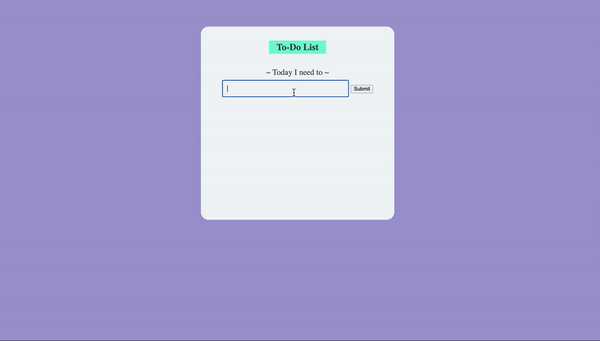

# challenge-dom

Buatlah sebuah halaman To-Do List seperti gambar di atas. Untuk desain dapat disesuaikan (warna, ukuran, penempatan). Namun, **PASTIKAN ID DAN NAMA FUNGSI TIDAK DIUBAH**.

### Cara kerja halaman:
- User dapat memasukkan text ke dalam input
- User dapat mengklik tombol untuk menambahkan text ke dalam `<ul>`
- Setelah tombol di klik, text akan ditambahkan sebagai `<li>` di dalam list yang ada, lalu isi dari input dikosongkan
- User dapat menekan enter di field input, jika ditekan akan menambahkan text juga ke dalam `<ul>`

### Ketentuan:
- Halaman terdiri dari judul, subtitle, input text, button, dan unordered list (`<ul>`)
- ID untuk masing-masing komponen:
    1. Container: `app`
    1. Judul: `todo-title`
    1. Subtitle: `todo-subtitle`
    1. Input: `todo-input`
    1. Button: `todo-submit`
    1. Ul: `todo-output`
- Fungsi yang dipasang di button saat diklik: `fnClickHandler`
- Fungsi yang dipasang di input saat ditekan enter di field input: `fnClickHandler`
- **Tidak perlu validasi jika input kosong** (input kosong jika disubmit akan menambahkan satu \<li\> kosong)
- CSS dapat ditaruh di dalam html dengan tag \<style\> atau CSS external. Jangan menggunakan library tambahan.
